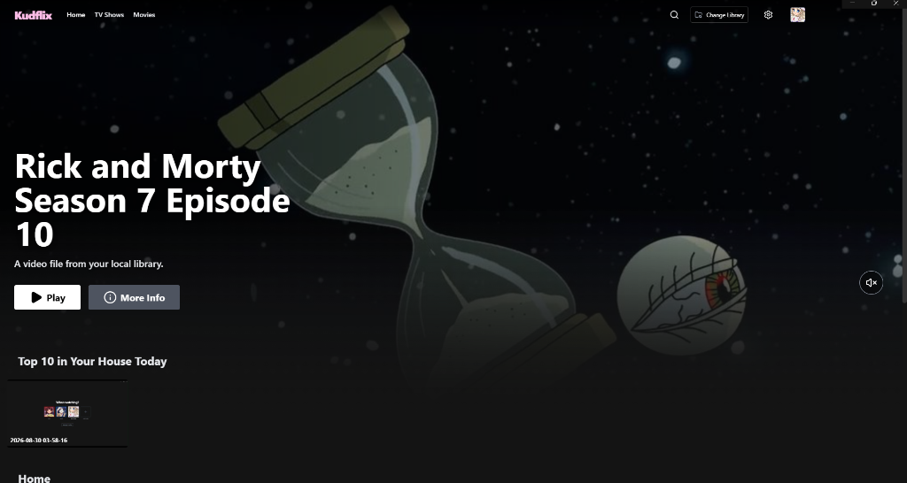
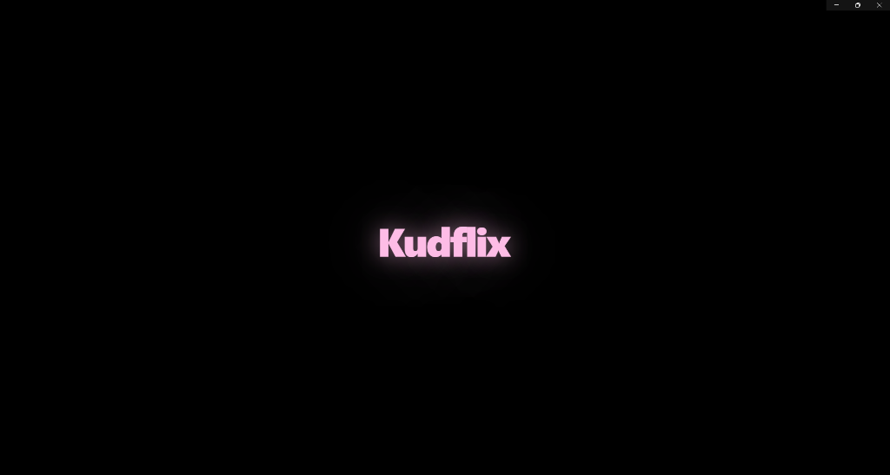
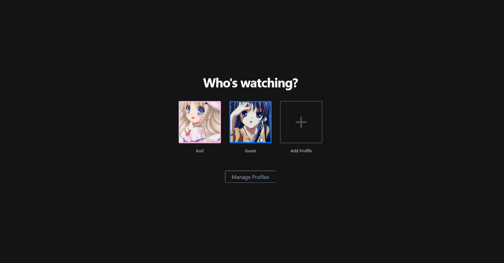
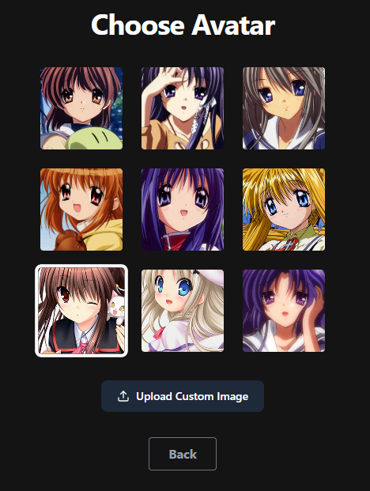
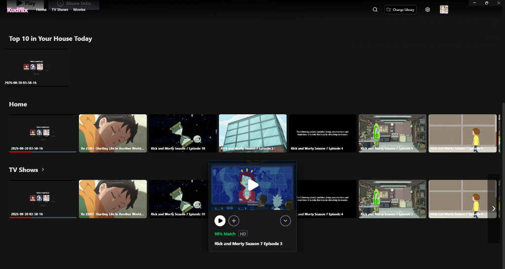

# Kudflix

A fully offline, Netflix-style desktop media player for your local video collection. Built with Electron, React, Vite, and Tailwind CSS.

## UI Showcase

### 1. Splash Screen
A clean and immersive startup experience featuring the Kudflix branding.


### 2. Who's Watching?
Manage your local viewing profiles, complete with custom themes and anime avatars.


### 3. Choose Avatar
Select from a curated grid of Key VN character avatars or upload your own custom image.


### 4. Home Screen & Hero Banner
Your local media library displayed in a sleek, Netflix-style layout, featuring a dynamic hero video preview with Ken Burns animation effects.


### 5. Quick Hover Actions
Instantly preview episodes, check progress, and launch playback seamlessly from hover cards.


## Features

- **Netflix-Style UI**: Experience a familiar, premium interface with horizontal scrolling carousels, full-width hero banners (Ken Burns effect), and Jawlet hover cards.
- **Auto-Categorization**: Automatically sorts your videos into "TV Shows" (under 1 hour) and "Movies" (over 1 hour) by analyzing video durations on the fly.
- **Smart Title Cleaner**: Automatically strips out pirate group tags (like `[AnimePahe]`), removes file extensions, and converts underscores/dots into spaces for a clean, professional library look. No need to rename your files or worry about embedded MKV metadata!
- **Instant Thumbnails**: Generates beautiful thumbnails and previews locally and instantly directly from the video files. No background server or scraper needed.
- **Resume Playback**: Automatically remembers where you left off for every video you watch.
- **Next Episode Overlay**: When a video finishes, a Netflix-style "Next Episode" button seamlessly guides you to the next file in the folder.
- **Custom Scaling & Theming**: Includes a Settings modal to adjust UI scaling (from 0.5x to 1.5x) and a custom dark theme scrollbar.
- **Frameless Window**: Custom drag-able title bar perfectly integrated with the UI, no ugly default Windows borders.

## Supported Formats

Kudflix natively supports playing formats supported by Chromium:
- `.mp4`
- `.webm`
- `.mkv` (if encoded with h264/avc)
- `.mov` (if encoded with h264/avc)

*Note: For the best experience, ensure your local media is encoded in H.264 video with AAC audio.*

## How it works

Just point the app to a folder containing your video files. Kudflix will:
1. Scan the directory.
2. Filter out non-video files.
3. Automatically grab duration and generate a thumbnail frame.
4. Clean the titles and categorize them into dynamic horizontal carousels.

No internet connection required. No databases. No accounts. No setup.

## Development

Kudflix is built on an extremely fast modern web stack:

### Prerequisites
- Node.js (v18 or higher)
- npm or yarn

### Quick Start
```bash
# Install dependencies
npm install

# Start in development mode (starts Vite and Electron)
npm start
```

### Building for Production
```bash
# Build the React app and package it into a portable Windows executable
npm run package
```
The final `.exe` will be located in the `release` folder.

## License

Open Source - Free to use and modify for your own local setup.
